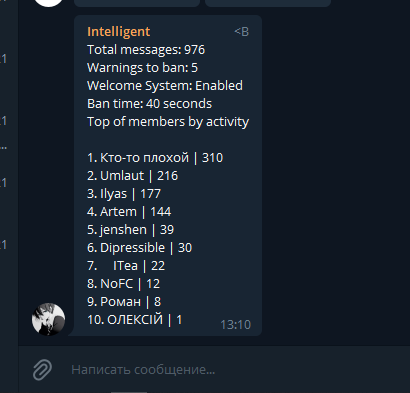
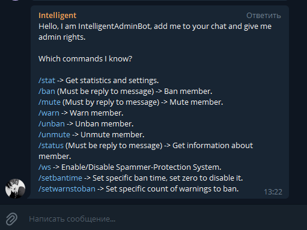

# IntelligentAdminBot
### Simple chatbot for telegram. 
Bot for my <a href='https://t.me/it_intelligency'>Telegram group</a> 
Bot helps to facilitate chat administration 

For example, you can send !ban as answer to another member of chat and ban it. 
Also, bot collects statistics, can mute/unmute, warn/unwarn member, can protect your chat from spammers (captcha) and other. 

## !stat Example  

## Full commands list available as !help
 
